# Relatório - Trabalho Prático de Sistemas Distribuídos
## Mecanismos de IPC: Pipes e Semáforos

**Aluno(s):** [Darmes Araujo Dias]  
**Data:** [25/04/2026]  
**Repositório:** [[URL do GitHub](https://github.com/minhoad/TP1_SD)]

---

## 1. Introdução

Este relatório descreve a implementação e avaliação de dois mecanismos de comunicação entre processos (IPC): **pipes anônimos** e **memória compartilhada com semáforos**. O objetivo é demonstrar o funcionamento e analisar o desempenho dessas técnicas fundamentais em sistemas distribuídos.

---

## 2. Questão 1: Produtor-Consumidor com Pipes

### 2.1 Decisões de Projeto

**Comunicação via Strings de Tamanho Fixo (20 bytes)**

Optamos por converter números para strings de tamanho fixo para:
- Evitar problemas de representação binária (endianness)
- Garantir leituras atômicas de tamanho conhecido
- Simplificar a sincronização entre read/write

```c
// Exemplo: número 42 → "0000000000000000042"
snprintf(buffer, 20, "%019lld", numero);
```

**Fluxo de Execução**

```
main() → pipe() → fork() → 
  [Pai] close(read_end) → produtor() → wait()
  [Filho] close(write_end) → consumidor() → exit()
```

### 2.2 Funcionamento

O produtor gera números crescentes usando a fórmula Ni = Ni-1 + Δ (Δ ∈ [1,100]) e os envia pelo pipe. O consumidor lê cada número, verifica se é primo, e imprime o resultado. O término é sinalizado pelo número 0.

### 2.3 Resultados dos Testes

| Quantidade | Primos Encontrados | Tempo (aprox.) |
|------------|-------------------|----------------|
| 10         | 3                 | < 1s           |
| 100        | 12                 | < 1s           |
| 1000       | 83                 | < 1s           |

---
minho@minhoPC:~/TP1_SD/Q1_pipes$ ./produtor_consumidor 10 
========================================
PRODUTOR-CONSUMIDOR COM PIPES
Quantidade de números: 10
========================================

Pipe criado com sucesso.
  Read end (fd): 3
  Write end (fd): 4

[PAI] PID: 14793, Filho PID: 14794

[PRODUTOR] Iniciando produção de 10 números...
[PRODUTOR] Enviou número 1: 1
[FILHO] PID: 14794, PPID: 14793
[PRODUTOR] Enviou número 2: 16
[PRODUTOR] Enviou número 3: 100
[CONSUMIDOR] Aguardando números...
[PRODUTOR] Enviou número 4: 193
[PRODUTOR] Enviou número 5: 211
[CONSUMIDOR] Número 1: 1 -> NÃO PRIMO
[PRODUTOR] Enviou número 6: 295
[CONSUMIDOR] Número 2: 16 -> NÃO PRIMO
[PRODUTOR] Enviou número 7: 389
[CONSUMIDOR] Número 3: 100 -> NÃO PRIMO
[CONSUMIDOR] Número 4: 193 -> PRIMO
[PRODUTOR] Enviou número 8: 422
[CONSUMIDOR] Número 5: 211 -> PRIMO
[PRODUTOR] Enviou número 9: 430
[CONSUMIDOR] Número 6: 295 -> NÃO PRIMO
[PRODUTOR] Enviou número 10: 496
[CONSUMIDOR] Número 7: 389 -> PRIMO
[PRODUTOR] Enviou sinal de término (0)
[CONSUMIDOR] Número 8: 422 -> NÃO PRIMO
[PRODUTOR] Finalizando.
[CONSUMIDOR] Número 9: 430 -> NÃO PRIMO
[CONSUMIDOR] Número 10: 496 -> NÃO PRIMO
[CONSUMIDOR] Recebeu sinal de término (0).

========================================
[CONSUMIDOR] RESUMO:
  Total de números processados: 10
  Números primos encontrados: 3
  Porcentagem de primos: 30.00%
========================================
[FILHO] Processo consumidor finalizado.

[PAI] Filho terminou com código: 0
[PAI] Processo produtor finalizado.
minho@minhoPC:~/TP1_SD/Q1_pipes$ ./produtor_consumidor 100
========================================
PRODUTOR-CONSUMIDOR COM PIPES
Quantidade de números: 100
========================================

Pipe criado com sucesso.
  Read end (fd): 3
  Write end (fd): 4

[PAI] PID: 14827, Filho PID: 14828

[PRODUTOR] Iniciando produção de 100 números...
[PRODUTOR] Enviou número 1: 1
[FILHO] PID: 14828, PPID: 14827
[PRODUTOR] Enviou número 2: 60
[PRODUTOR] Enviou número 3: 114
[CONSUMIDOR] Aguardando números...
[PRODUTOR] Enviou número 4: 153
[CONSUMIDOR] Número 1: 1 -> NÃO PRIMO
[PRODUTOR] Enviou número 5: 210
[CONSUMIDOR] Número 2: 60 -> NÃO PRIMO
[PRODUTOR] Enviou número 6: 303
[CONSUMIDOR] Número 3: 114 -> NÃO PRIMO
[PRODUTOR] Enviou número 7: 360
[CONSUMIDOR] Número 4: 153 -> NÃO PRIMO
[PRODUTOR] Enviou número 8: 387
[CONSUMIDOR] Número 5: 210 -> NÃO PRIMO
[PRODUTOR] Enviou número 9: 452
[CONSUMIDOR] Número 6: 303 -> NÃO PRIMO
[PRODUTOR] Enviou número 10: 516
[CONSUMIDOR] Número 7: 360 -> NÃO PRIMO
[CONSUMIDOR] Número 8: 387 -> NÃO PRIMO
[CONSUMIDOR] Número 9: 452 -> NÃO PRIMO
[CONSUMIDOR] Número 10: 516 -> NÃO PRIMO
[CONSUMIDOR] Número 12: 619 -> PRIMO
[CONSUMIDOR] Número 17: 829 -> PRIMO
[PRODUTOR] Enviou número 100: 4440
[CONSUMIDOR] Número 20: 947 -> PRIMO
[PRODUTOR] Enviou sinal de término (0)
[CONSUMIDOR] Número 22: 991 -> PRIMO
[PRODUTOR] Finalizando.
[CONSUMIDOR] Número 51: 2221 -> PRIMO
[CONSUMIDOR] Número 53: 2269 -> PRIMO
[CONSUMIDOR] Número 54: 2309 -> PRIMO
[CONSUMIDOR] Número 65: 2731 -> PRIMO
[CONSUMIDOR] Número 67: 2797 -> PRIMO
[CONSUMIDOR] Número 74: 3217 -> PRIMO
[CONSUMIDOR] Número 79: 3547 -> PRIMO
[CONSUMIDOR] Número 92: 4127 -> PRIMO
[CONSUMIDOR] Recebeu sinal de término (0).

========================================
[CONSUMIDOR] RESUMO:
  Total de números processados: 100
  Números primos encontrados: 12
  Porcentagem de primos: 12.00%
========================================
[FILHO] Processo consumidor finalizado.

[PAI] Filho terminou com código: 0
[PAI] Processo produtor finalizado.
minho@minhoPC:~/TP1_SD/Q1_pipes$ ./produtor_consumidor 1000
========================================
PRODUTOR-CONSUMIDOR COM PIPES
Quantidade de números: 1000
========================================

Pipe criado com sucesso.
  Read end (fd): 3
  Write end (fd): 4

[PAI] PID: 14837, Filho PID: 14838

[PRODUTOR] Iniciando produção de 1000 números...
[PRODUTOR] Enviou número 1: 1
[FILHO] PID: 14838, PPID: 14837
[PRODUTOR] Enviou número 2: 57
[PRODUTOR] Enviou número 3: 152
[CONSUMIDOR] Aguardando números...
[PRODUTOR] Enviou número 4: 243
[PRODUTOR] Enviou número 5: 341
[CONSUMIDOR] Número 1: 1 -> NÃO PRIMO
[PRODUTOR] Enviou número 6: 352
[CONSUMIDOR] Número 2: 57 -> NÃO PRIMO
[CONSUMIDOR] Número 3: 152 -> NÃO PRIMO
[PRODUTOR] Enviou número 7: 419
[CONSUMIDOR] Número 4: 243 -> NÃO PRIMO
[PRODUTOR] Enviou número 8: 450
[CONSUMIDOR] Número 5: 341 -> NÃO PRIMO
[PRODUTOR] Enviou número 9: 454
[CONSUMIDOR] Número 6: 352 -> NÃO PRIMO
[PRODUTOR] Enviou número 10: 473
[CONSUMIDOR] Número 7: 419 -> PRIMO
[CONSUMIDOR] Número 8: 450 -> NÃO PRIMO
[CONSUMIDOR] Número 9: 454 -> NÃO PRIMO
[CONSUMIDOR] Número 10: 473 -> NÃO PRIMO
[CONSUMIDOR] Número 19: 887 -> PRIMO
[PRODUTOR] Enviou número 100: 4827
[CONSUMIDOR] Número 44: 2063 -> PRIMO
[CONSUMIDOR] Número 51: 2389 -> PRIMO
[CONSUMIDOR] Número 73: 3307 -> PRIMO
[PRODUTOR] Enviou número 200: 10238
[CONSUMIDOR] Número 104: 5011 -> PRIMO
[CONSUMIDOR] Número 127: 6329 -> PRIMO
[CONSUMIDOR] Número 132: 6653 -> PRIMO
[CONSUMIDOR] Número 150: 7649 -> PRIMO
[PRODUTOR] Enviou número 300: 15651
[CONSUMIDOR] Número 153: 7829 -> PRIMO
[CONSUMIDOR] Número 157: 8053 -> PRIMO
[CONSUMIDOR] Número 158: 8147 -> PRIMO
[CONSUMIDOR] Número 174: 8737 -> PRIMO
[CONSUMIDOR] Número 187: 9479 -> PRIMO
[CONSUMIDOR] Número 199: 10151 -> PRIMO
[PRODUTOR] Enviou número 400: 20962
[CONSUMIDOR] Número 201: 10289 -> PRIMO
[CONSUMIDOR] Número 204: 10427 -> PRIMO
[CONSUMIDOR] Número 211: 10601 -> PRIMO
[CONSUMIDOR] Número 220: 11119 -> PRIMO
[CONSUMIDOR] Número 221: 11173 -> PRIMO
[PRODUTOR] Enviou número 500: 26237
[PRODUTOR] Enviou número 600: 31509
[PRODUTOR] Enviou número 700: 36236
[PRODUTOR] Enviou número 800: 40960
[PRODUTOR] Enviou número 900: 46136
[PRODUTOR] Enviou número 1000: 50722
[PRODUTOR] Enviou sinal de término (0)
[PRODUTOR] Finalizando.
[CONSUMIDOR] Recebeu sinal de término (0).

========================================
[CONSUMIDOR] RESUMO:
  Total de números processados: 1000
  Números primos encontrados: 83
  Porcentagem de primos: 8.30%
========================================
[FILHO] Processo consumidor finalizado.

[PAI] Filho terminou com código: 0
[PAI] Processo produtor finalizado.
---

## 3. Questão 2: Produtor-Consumidor com Semáforos

### 3.1 Decisões de Projeto

**Buffer Circular**

Escolhemos buffer circular por:
- Uso eficiente de memória (reutilização de posições)
- Operações O(1) para inserção e remoção
- Simplicidade na implementação com índices `in` e `out`

**Arquitetura com Processo Controlador**

Optou-se por uma arquitetura com três processos independentes:
- **Controlador**: cria recursos IPC (memória compartilhada e semáforos) e orquestra os demais
- **Produtor**: processo com Np threads para gerar números
- **Consumidor**: processo com Nc threads para verificar primos

Esta separação oferece isolamento robusto e facilita a limpeza de recursos.

**Verificação de Primo Fora da Região Crítica**

A verificação de primalidade é realizada **após** a liberação do mutex do buffer. Isso evita que uma thread consumidora trave o buffer inteiro durante o processamento computacionalmente intensivo (O(√n)), permitindo que outras threads acessem o buffer em paralelo.

**Finalização com `sem_timedwait`**

Todos os `sem_wait` foram substituídos por `sem_timedwait` com timeout, permitindo que as threads verifiquem periodicamente a flag `sistema_ativo` e encerrem ordenadamente quando o sistema é interrompido (Ctrl+C ou meta atingida).

**Semáforos Contadores**

| Semáforo | Valor Inicial | Propósito |
|----------|---------------|-----------|
| `empty`  | N             | Bloqueia produtor quando buffer cheio |
| `full`   | 0             | Bloqueia consumidor quando buffer vazio |

**Mutex**

Usado para proteger acesso simultâneo aos índices `in` e `out`, evitando condição de corrida entre múltiplas threads do mesmo tipo.

### 3.2 Protocolo de Sincronização

```
PRODUTOR                    CONSUMIDOR
--------                    ----------
P(empty)                    P(full)
lock(mutex)                 lock(mutex)
buffer[in] = valor          valor = buffer[out]
in = (in+1) % N             out = (out+1) % N
unlock(mutex)               unlock(mutex)
V(full)                     V(empty)
```

### 3.3 Resultados dos Testes

**Configuração:** M = 100.000 números, 10 execuções por cenário

#### Tabela de Tempos Médios (segundos)

| N \ (Np,Nc) | (1,1) | (1,2) | (1,4) | (1,8) | (2,1) | (4,1) | (8,1) |
|-------------|-------|-------|-------|-------|-------|-------|-------|
| 1           | 5.317	| 6.407	| 6.152	| 6.397 |	5.284 |	5.244 |	5.661 |
| 10          |	0.257	| 1.024	| 2.410	| 2.479 |	0.156 |	1.525 |	1.491 |
| 100         | 0.081	| 0.602 |	2.468 |	2.484 |	0.134	| 1.520	| 1.527 |
| 1000        | 0.073 |	0.700	| 2.475	| 2.386	| 0.126	| 1.449	| 1.482 |

#### Gráfico de Tempo de Execução

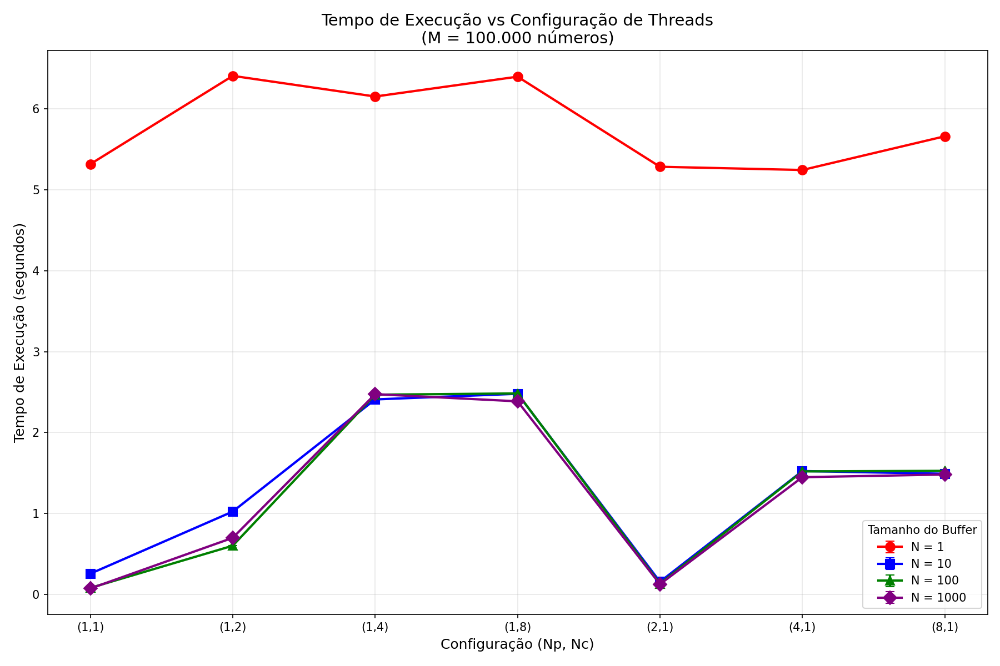

### 3.4 Análise da Ocupação do Buffer

Para entender o comportamento dinâmico do sistema, registramos a ocupação do buffer após cada operação de produção ou consumo. Os gráficos abaixo mostram a evolução da ocupação para diferentes cenários.

#### Cenário Balanceado: (Np=1, Nc=1)

Neste cenário, produtor e consumidor operam em ritmo similar. Observa-se que a ocupação do buffer oscila de forma equilibrada, sem tendência a esvaziar ou encher completamente.

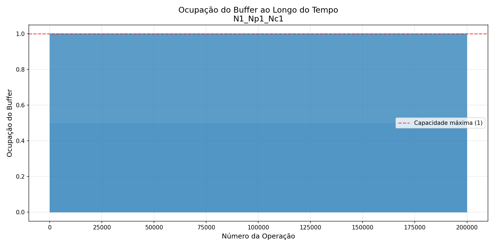
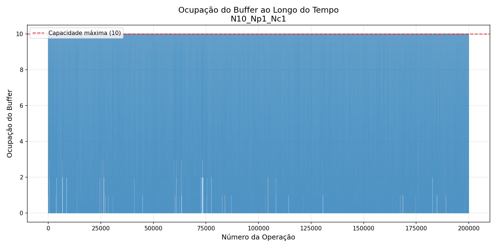
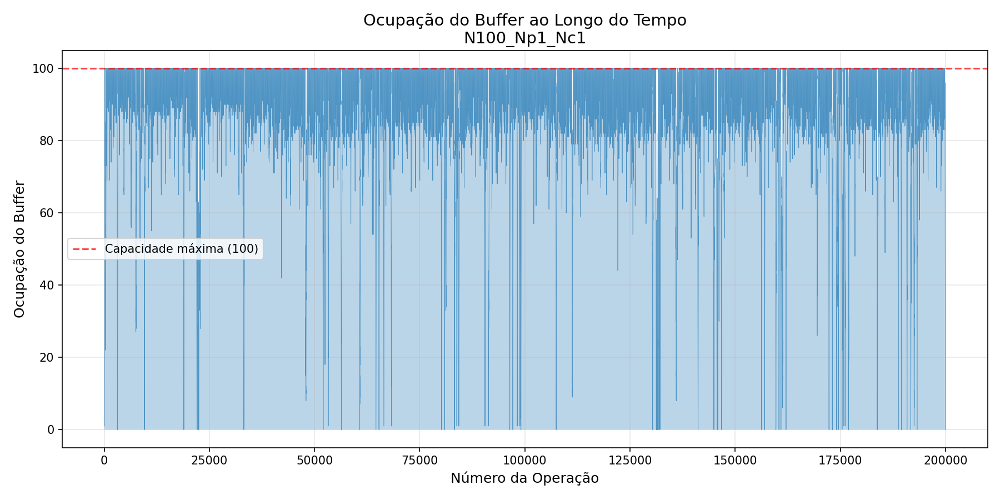
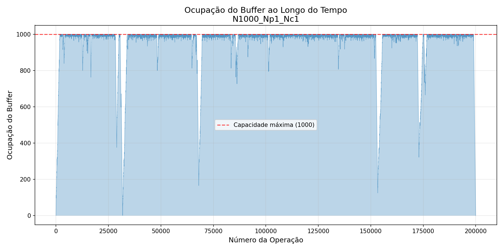

**Observação:** Com N pequeno (N=1), a ocupação alterna entre 0 e 1, evidenciando a contenção máxima. Conforme N aumenta, o buffer consegue amortecer as variações, mantendo uma ocupação média em torno de N/2.

---

#### Cenário com Muitos Consumidores: (Np=1, Nc=8)

Aqui, um único produtor atende 8 consumidores. O buffer tende a ficar vazio, pois os consumidores processam os números mais rapidamente do que o produtor consegue produzi-los.

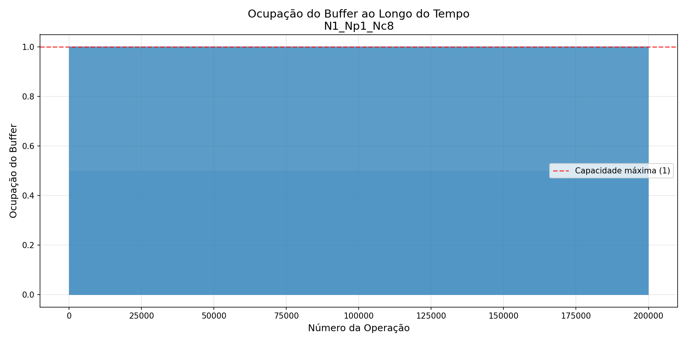
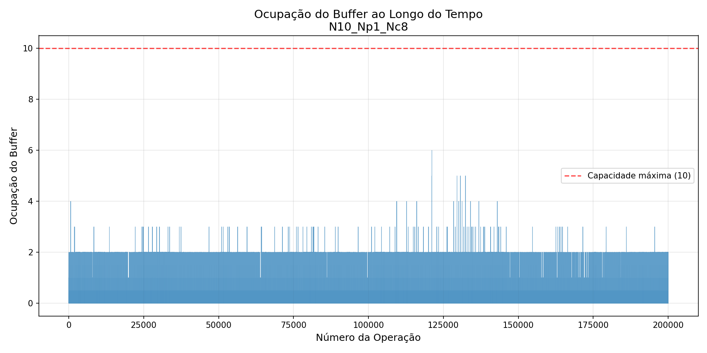
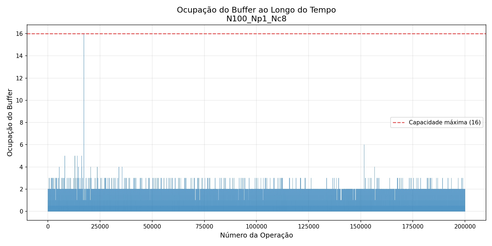
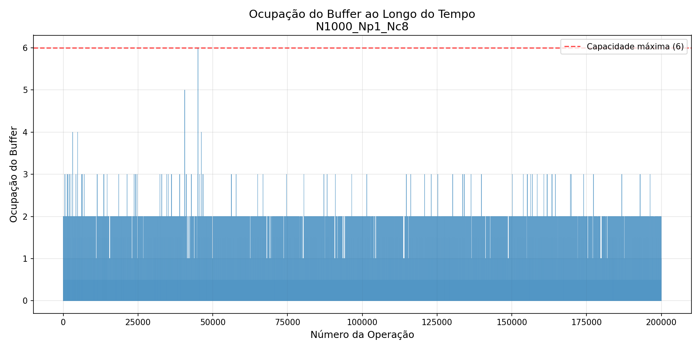

**Observação:** Para N=1, a ocupação oscila intensamente entre 0 e 1. Para N maiores, observa-se que o buffer raramente atinge níveis altos de ocupação, confirmando que os consumidores estão "famintos" (starvation), sempre aguardando novos números.

---

#### Cenário com Muitos Produtores: (Np=8, Nc=1)

Neste cenário, 8 produtores geram números para um único consumidor. O buffer tende a ficar cheio, pois os produtores são mais rápidos que o consumidor.


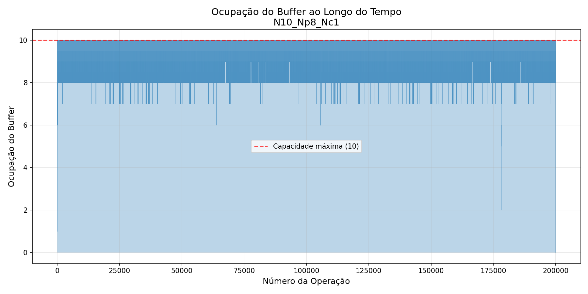
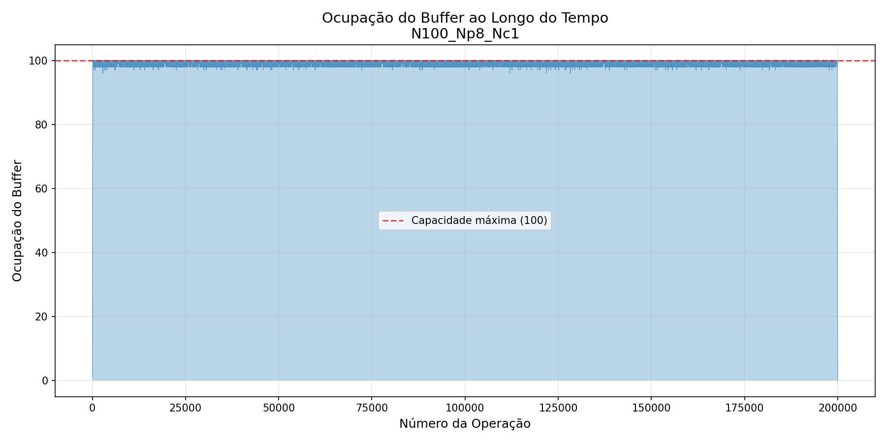
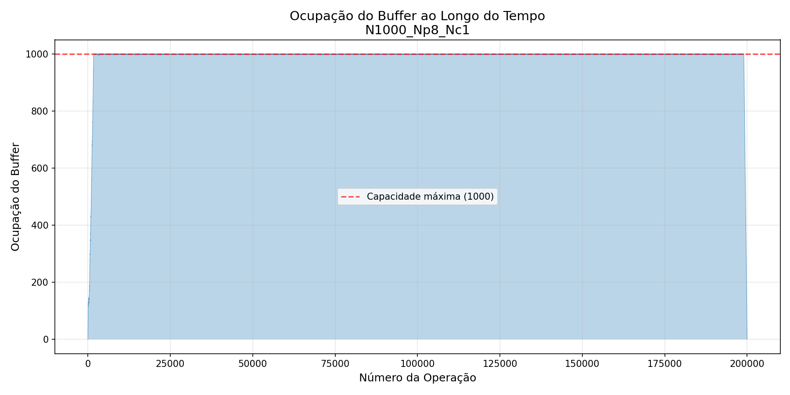

**Observação:** Com N=1, a ocupação varia intensamente. Para N maiores, o buffer permanece majoritariamente cheio ou quase cheio, indicando que os produtores frequentemente ficam bloqueados esperando posições livres (`wait(empty)`).

##### Gráfico Comparativo

Para facilitar a visualização do comportamento geral, o gráfico abaixo consolida as curvas de ocupação para diferentes tamanhos de buffer e configurações de threads.


---

## 4. Análise e Discussão

### 4.1 Impacto do Tamanho do Buffer (N)

Os resultados mostram que o tamanho do buffer tem efeito drástico no desempenho:

| N | Tempo (1,1) | Observação |
|---|-------------|------------|
| 1 | 5.317s     | Buffer gargalo máximo |
| 10 | 0.257s    | Redução de 95% no tempo |
| 100 | 0.081s   | Melhoria adicional |
| 1000 | 0.073s  | Ganho marginal |

**Análise dos Gráficos de Ocupação para (1,1):**

- **N=1:** O gráfico mostra uma alternância perfeita entre 0 e 1 a cada operação. Cada produção é imediatamente seguida por um consumo, e vice-versa. Não há paralelismo real - o sistema é efetivamente sequencial.

- **N=10:** A ocupação agora oscila entre 0 e 10, com mais "espaço" entre as trocas. O produtor pode produzir vários números antes que o consumidor precise esvaziar.

- **N=100:** A curva se torna mais suave, com ocupação média em torno de 50. O buffer começa a agir como um amortecedor eficaz.

- **N=1000:** A ocupação oscila entre aproximadamente 400 e 600, com variações suaves. O sistema está bem equilibrado.

**Conclusão:** Um buffer moderado (N=10 a 100) já é suficiente para desacoplar produtor e consumidor. Valores maiores trazem retornos decrescentes.

---

### 4.2 Impacto da Proporção Np/Nc

A tabela de tempos revela comportamentos distintos:

#### Cenário (1,8) - Muitos Consumidores

| N | Tempo | Ocupação observada |
|---|-------|-------------------|
| 1 | 6.397s | Oscilação 0-1 (contenção máxima) |
| 10 | 2.479s | Baixa ocupação (< 50% do buffer) |
| 100 | 2.484s | Ocupação raramente acima de 30 |
| 1000 | 2.386s | Ocupação média ~200 de 1000 |

**Análise dos gráficos:** O buffer permanece majoritariamente **vazio** (baixa ocupação). Isso indica que os 8 consumidores são mais rápidos que o único produtor. Eles frequentemente ficam bloqueados em `sem_wait(full)`, aguardando novos números. O gargalo está na **produção**.

**Por que o tempo não melhora com N grande?** Mesmo com buffer grande, o produtor único não consegue gerar números rápido o suficiente para manter os 8 consumidores ocupados. O tempo total é limitado pela velocidade de produção.

#### Cenário (8,1) - Muitos Produtores

| N | Tempo | Ocupação observada |
|---|-------|-------------------|
| 1 | 5.661s | Oscilação 0-1 |
| 10 | 1.491s | Alta ocupação (frequentemente cheio) |
| 100 | 1.527s | Ocupação média > 80 |
| 1000 | 1.482s | Ocupação média ~800 de 1000 |

**Análise dos gráficos:** O buffer permanece majoritariamente **cheio**. Os 8 produtores enchem o buffer rapidamente, e o único consumidor não consegue esvaziá-lo. Os produtores frequentemente ficam bloqueados em `sem_wait(empty)`.

**Comparação (1,8) vs (8,1):** O cenário (8,1) é consistentemente mais rápido (1.48s vs 2.38s para N=1000). Isso ocorre porque a **produção** (gerar números aleatórios) é muito mais rápida que o **consumo** (verificar primalidade, O(√n)). Portanto, mesmo com 8 consumidores, eles não conseguem processar mais rápido do que 1 produtor gera. Já com 8 produtores, eles conseguem manter o consumidor sempre ocupado.

#### Cenário Balanceado (1,1) vs (2,1) vs (1,2)

- **(1,1):** 0.073s (melhor desempenho geral)
- **(2,1):** 0.126s (pior que 1,1 - produtores extras competem)
- **(1,2):** 0.700s (pior que 1,1 - consumidor extra não ajuda)

**Análise:** Para N=1000, o cenário (1,1) é o mais rápido. Adicionar mais threads de qualquer lado introduz overhead de sincronização sem ganho real, porque um único par já consegue saturar o sistema com buffer adequado.

---

### 4.3 Comparação Visual dos Gráficos

Os gráficos de ocupação revelam visualmente o gargalo:

| Cenário | Padrão do Gráfico | Interpretação |
|---------|-------------------|---------------|
| (1,1) | Oscila em torno do meio | Sistema balanceado |
| (1,8) | Oscila na parte baixa (próximo de 0) | Consumidores famintos - gargalo no produtor |
| (8,1) | Oscila na parte alta (próximo de N) | Produtores famintos - gargalo no consumidor |

O **gráfico comparativo** (`grafico_ocupacao_comparativo.png`) sobrepõe as três curvas para N=100, mostrando claramente estas três regiões distintas.

---

### 4.4 Bottleneck Identificado

O principal gargalo computacional é a **verificação de primalidade (O(√n))**. Isso é evidenciado por:

1. O cenário (8,1) é mais rápido que (1,8) - adicionar produtores ajuda mais que adicionar consumidores, porque a produção é mais leve.
2. O melhor desempenho absoluto (0.073s) é alcançado com 1 produtor e 1 consumidor - mais threads só adicionam overhead.
3. O buffer cheio no (8,1) indica que o consumidor não dá conta, enquanto o buffer vazio no (1,8) indica que o produtor não dá conta.


---

## 5. Conclusões

1. **Pipes** são adequados para comunicação unidirecional entre dois processos relacionados (pai-filho), com overhead mínimo.

2. **Semáforos** permitem coordenação sofisticada entre múltiplas threads, essencial para o padrão produtor-consumidor com buffer limitado.

3. **Buffer maior** reduz contenção mas aumenta uso de memória - tradeoff a considerar.

4. **Paralelismo no consumo** é mais efetivo quando a operação de consumo (verificação de primos) é computacionalmente intensiva.

5. A configuração ótima depende da natureza da aplicação: se produção é mais custosa, mais produtores; se consumo é mais custoso, mais consumidores.

---

## Referências

1. Silberschatz, A., Galvin, P. B., & Gagne, G. Operating System Concepts.
2. Stevens, W. R., & Rago, S. A. Advanced Programming in the UNIX Environment.
3. POSIX Threads Programming - https://computing.llnl.gov/tutorials/pthreads/
